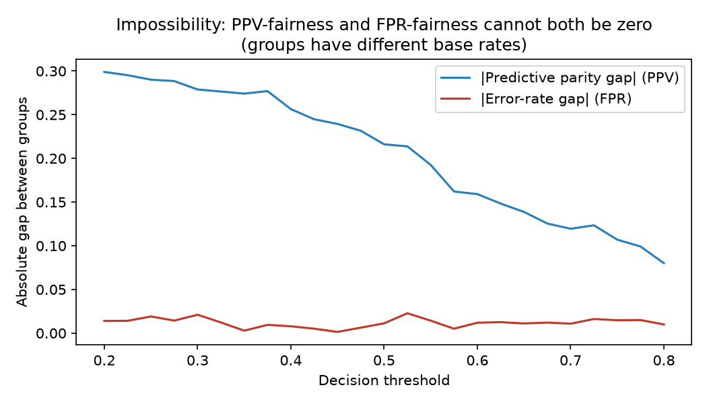

<div align="center">

# ⚖️ EthicLens

### An AI Bias Detection & Mitigation Workbench for regulated decision models

Unifies fairness **detection**, prescriptive **mitigation**, and formal **governance sign-off**
in one tool — for compliance officers as well as ML engineers. Built for EU AI Act / EEOC
audit requirements.

**[▶ Try the live demo](https://huggingface.co/spaces/vardhjain20/Ethiclens)** &nbsp;·&nbsp; **[📖 Docs](https://vardhjain.github.io/Ethiclens/)**

[](https://huggingface.co/spaces/vardhjain20/Ethiclens)
[](https://github.com/vardhjain/Ethiclens/actions/workflows/ci-python.yml)
[](https://github.com/vardhjain/Ethiclens/actions/workflows/golden-audit.yml)
[](https://github.com/vardhjain/Ethiclens/actions/workflows/security.yml)
[](.github/workflows/ci-python.yml)
[](pyproject.toml)
[](LICENSE)
[](https://github.com/astral-sh/ruff)

</div>

> [!NOTE]
> **Read this first:** [`LIMITATIONS.md`](LIMITATIONS.md) — exactly what this tool does and does
> **not** prove. Honesty about epistemics is a feature, not an afterthought.

---

## Why this exists

Organisations deploying automated hiring, lending and risk models face real legal and
reputational exposure when those models discriminate. Existing tools force a trade-off:

| Tool | Detection | **Mitigation** | Governance | Non-technical UI |
|---|:---:|:---:|:---:|:---:|
| IBM AI Fairness 360 | ✅ (code-only) | ✅ (code-only) | ❌ | ❌ |
| Google What-If Tool | ✅ (viz-only) | ❌ | ❌ | ⚠️ |
| **EthicLens** | ✅ | ✅ **executable + measured** | ✅ sign-off + audit trail | ✅ |

EthicLens closes the loop from *"this model is biased"* to *"here is a measured fix and a
signed, immutable audit record."*

## What makes it credible (the three things to look at)

1. **Verifiable numeric correctness.** Every fairness metric is implemented **from scratch** and
   **cross-validated against [Fairlearn](https://fairlearn.org/) to a 1e-9 tolerance**, with
   [Hypothesis](https://hypothesis.readthedocs.io/) property tests. A **golden-reference model**
   with an empirically-pinned Disparate Impact (≈ 0.55) is **asserted in CI** — if the bias math
   ever drifts, the build goes red. *Almost no portfolio repo can prove its math is correct.*
2. **Real, measured mitigation — never faked.** A held-out **accuracy-vs-fairness Pareto frontier**
   (with bootstrap CI error bars) feeds a ranked recommender; the reported improvement is a
   *measured* delta on data the mitigation never touched, and the re-audit actually crosses the
   0.80 threshold.
3. **Security & responsible-AI maturity.** Uploaded models are deserialised in a **sandbox** (the
   original spec's `pickle.load` of untrusted files is a remote-code-execution hole — fixed here),
   metrics ship with **bootstrap confidence intervals** and minimum-subgroup floors, and every
   audit emits a **Model Card** + **Datasheet** + an honesty banner.

## ▶ Quickstart

```bash
# 1. The engine, proven correct, in 30 seconds (no Docker needed)
uv venv && uv pip install -e "packages/fairness-core[validation,viz,cli]"
uv run ethiclens-audit demo          # trains a biased model, audits it, prints a scorecard
make audit-golden                    # reproduces the CI-pinned golden DI ≈ 0.55

# 2. The full stack (API + Postgres + React + MLflow)
cp .env.example .env
docker compose up --build            # → web http://localhost:5173 · api http://localhost:8000/docs
```

## Example: the scorecard the CLI prints

```
==============================================================================
                         EthicLens Fairness Scorecard
==============================================================================
Composite Bias Score: 0.612  [Medium Risk]   (higher = fairer)
Worst-group Disparate Impact: 0.55   Labels available: yes
------------------------------------------------------------------------------
Group                      DI          95% CI     SPD      EO    Flag
------------------------------------------------------------------------------
race:Black              0.553   [0.51,0.60]  -0.282   0.141    FLAG
race:Hispanic           0.910   [0.86,0.96]  -0.058   0.044      ok
race:Asian              1.020   [0.97,1.07]   0.014   0.031      ok
==============================================================================
[!] 1 flagged group(s): race:Black
    A group is flagged only when its DI confidence interval is below 0.80.
==============================================================================
```

`ethiclens-audit mitigate` then ranks fixes and applies the top one, re-auditing on held-out
data — e.g. ThresholdOptimizer drives **race:Black DI 0.36 → 0.91 (crosses 0.80)** for ~1% accuracy.

## Architecture

A three-tier system around one shared, audited fairness engine.

```
┌──────────────┐   REST/JSON    ┌────────────────────────┐   imports   ┌────────────────────┐
│  React 18 UI │ ─────────────▶ │  FastAPI service       │ ──────────▶ │  fairness-core     │
│  (Mantine)   │ ◀───────────── │  + arq async workers   │             │  (pure, mypy-strict│
└──────────────┘   poll status  │  + sandboxed ingestion │             │   Fairlearn-proven)│
                                 └───────────┬────────────┘             └────────────────────┘
                                             │  SQLAlchemy 2.0 (async)         ▲   imports
                                       ┌──────▼───────┐                  ┌─────┴──────┐
                                       │ PostgreSQL 16│                  │  ml/ + CLI │
                                       │ 5-entity model│                 │ notebooks  │
                                       └──────────────┘                  └────────────┘
```

The **same `fairness_core` code** powers the API workers, the CLI, and the notebooks, so the
numbers can never diverge between "what the demo shows" and "what the service computes."

## Repository layout

| Path | What |
|---|---|
| `packages/fairness-core/` | ★ The audited metric + mitigation engine (zero web/db deps) |
| `services/api/` | FastAPI app, async ORM, arq workers, sandboxed model ingestion |
| `apps/web/` | React 18 + Vite + TypeScript workbench |
| `ml/` | Dataset loaders, model training, the golden oracle, notebooks, CLI |
| `docs/` | Methodology, ADRs, STP traceability matrix, per-persona guides |
| `infra/` · `.github/` | Docker/compose · CI, golden-audit gate, security scans |

## Live demo & notebook

- ▶ **[Interactive live demo](https://huggingface.co/spaces/vardhjain20/Ethiclens)** — a Gradio app
  (source: [`ml/demo/app.py`](ml/demo/app.py)) that audits a biased model and applies a measured
  mitigation in the browser.
- 📓 **Narrative notebook** — [*Why synthetic-persona auditing is broken — and the fix*](ml/notebooks/why_synthetic_auditing_is_broken.py),
  including the **impossibility theorem** demonstration:

  

- 🧾 Generated outputs: [sample Fairness Scorecard PDF](docs/sample-scorecard.pdf) ·
  [Model Card](docs/sample-model-card.md) · [Datasheet](docs/sample-datasheet.md).

## Documentation

- 📐 [Methodology](docs/methodology.md) — metric formulas, the composite rationale, and the
  methodological fix over the original spec.
- 🧾 [STP traceability matrix](docs/traceability-matrix.md) — every requirement → code + test.
- 🏛️ [Architecture Decision Records](docs/adr/) — the choices and why.
- ⚠️ [Limitations](LIMITATIONS.md) — what this does **not** prove.

## Provenance

EthicLens began as a graduate **System Test Plan** (GWU SEAS) that was never implemented. This
repository is the implementation — and, deliberately, a **correction**: the original design
audited models on synthetic personas, which cannot measure real disparate impact. See
[`docs/methodology.md`](docs/methodology.md) and the original document in
[`docs/original-stp.pdf`](docs/original-stp.pdf).

## License

[MIT](LICENSE) © 2026 Vardh Jain
